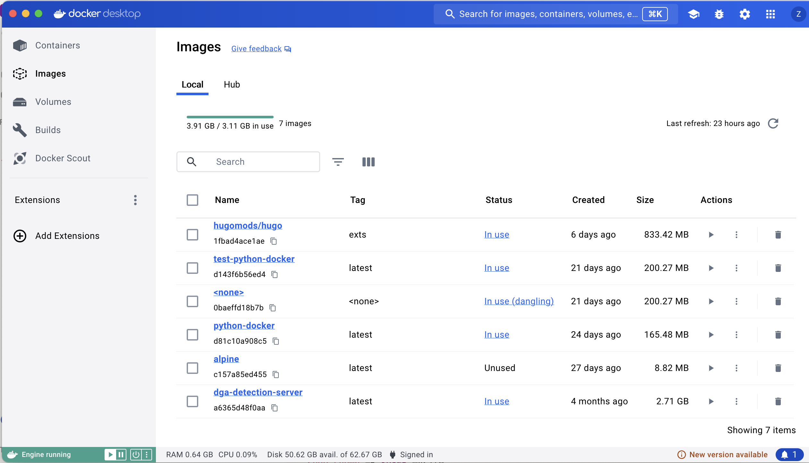
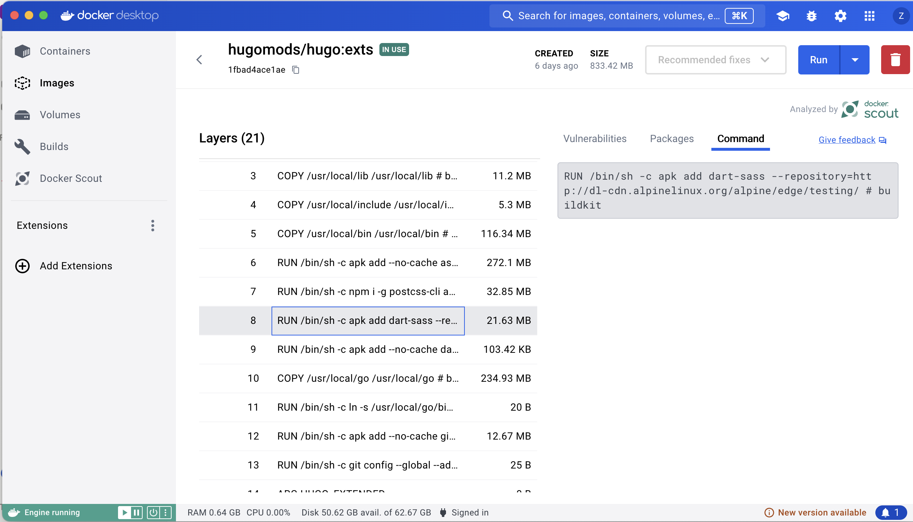
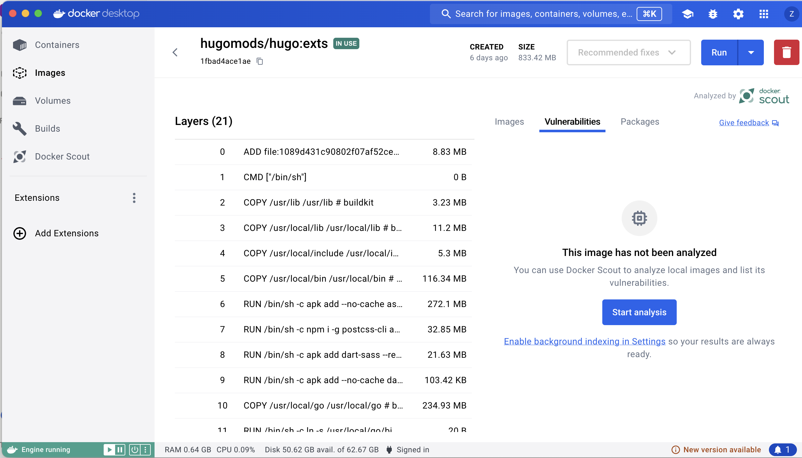
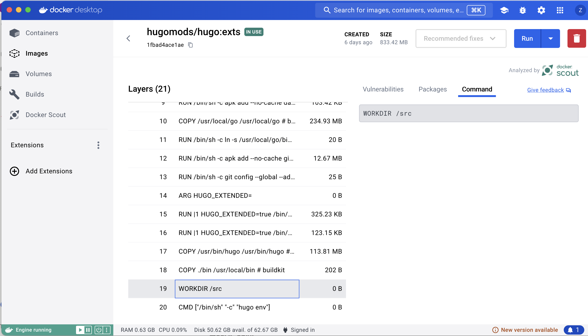

# Create a Static Website Using Hugo and Docker Compose

In this assignment, we’ll see how to use Docker containers not only for deploying our application, but also for developing our application. We’ll use a popular Hugo image to spin up a local version of our website and make changes in real time. 

# **Part 1: Pull and Run the Image**

## **Step 1: Launch Docker Desktop**

- Open Docker Desktop to start the docker daemon.

## **Step 2: Pull the image**

The image we will be working with is called `hugomods/hugo` and there are various tags that we can use for custom functionality. We’ll be using the extended version of hugo, so we’ll pull the image with the tag `:exts`.  The extended image includes several dependencies that can help us customize a theme. These dependencies include embedded dart sass, postcss, cli, autoprefixer, purgeCSS, RTLCSS, AsciiDoc and Pandoc. You can learn more about these libraries and the functionality they provide by reading the docs.

`hugomods/hugo` base image is Alpine. This image will create a default working directory of `/src` 

Open a terminal or command prompt (or Windows Powershell) and pull the image that contains the required dependencies for our Hugo site. 

```bash
docker pull hugomods/hugo:exts
```

In Docker Desktop, inspect the container image. Go to the `Images` tab in the left-hand navigation. Note the tag, status, created, and size metadata. 



 Now select the `hugomods/hugo` image by clicking on the name of the image. In this view, we can see that the image has several layers. Select one of the layers and inspect the layer further. Try clicking on the `command` tab in the image view. 



Note that some of the layers that add significantly to the image’s size. What do these layers have in common? 

Note the last layer in the image is a `CMD` instruction.

```docker
CMD ["/bin/sh" "-c" "hugo env"]
```

This command opens a shell, prints the hugo environment configuration, and then exits. That’s it! It’s a `no-op` (no operation) command. So if we run this image without passing any additional flags or commands to it, nothing will happen other than launching a shell and printing a message. 

**Container security:**

You can also run vulnerability scans on the container image. On the right half of the screen is a tab that says “Vulnerabilities”. In this UI, you’re able to run a scan on the container image and any known vulnerabilities (specifically CVEs) associated with any of the packages that make up the container will be highlighted for you: 



Click on `Start analysis` and see what vulnerabilities pop up. Nearly every image you ever work with will have some vulnerability, with varying degrees of severity. Part of your job as a responsible, security-minded engineer is to determine what degree of risk you’re willing to accept from your container images. 

Now that we’ve inspected our image, we’re ready to run it. First, clone this repository to your local machine. 

(As a reminder, you can clone this repository by selecting the green box that says `Code` at the top of the repository, then run `git clone` followed by the URL. 

Once you’ve cloned the Assignment 6 repository locally, `cd` into the repository and then proceed.

 In a terminal or Windows Powershell, run the command below: replace `<myresume>` with whatever you’d like your project to be called.

```bash
docker run -v ${PWD}:/src hugomods/hugo:exts hugo new site <myresume> -f "yaml"
```

Let’s break down this command piece by piece:

- `docker run` : we are already familiar with `docker run` . This is going to tell the docker daemon to run an image with any flags and commands we pass to it.
- `-v` binds the working directory to a new directory called `/src` inside the container.
    - `${PWD}` is made up of two interesting parts:
        - `pwd` is a command that prints the working directory.
        - `${ }` is a way of passing variables to a command.
    - Put together, the `${PWD}` command will pass the current directory to the rest of the `-v` command, and mount the current directory to the container’s working directory, which is `/src` . To see that `/src` is the working directory in the container, you can look at the container image, in layer 19:
    
    
    
- `hugo new site` : creates the site. Following `hugo new site` is another term, `mysite` . This will be the name of your new hugo site. You can use whatever name you’d like to- it could be related to a domain name that you’d like to use, or you can call it `myblog` , it doesn’t really matter.
- `-f` flag: uses `yaml` configuration instead of `toml` . We’ll use `yaml` because it will help to reinforce using `yaml` in future assignments 🙂

**macOS only:**

Run the following command to change ownership of the directory that’s created when running the docker run command. Change <mysite> to whatever you named your project in the docker run command. 

```bash
sudo chown -R $USER <mysite>
```

## Step 3: Use Docker Compose

[About Docker Compose](../docs/docker_compose/README.md)

In the root of your project, create a new file called `docker-compse.yml` Copy and paste the following content into your `docker-compose.yml` file: 

```yaml
name: my-site

services:
  server:
    image: hugomods/hugo:exts
    command: hugo server --bind 0.0.0.0
    volumes:
      - $PWD:/src
      - $HOME/hugo_cache:/tmp/hugo_cache
    ports:
      - 1313:1313

```

Let’s walk through our `docker compose` file: 

This is one of (or maybe our first) yaml file. YAML stands for “yet another markup language”. We use yaml extensively in cloud native computing, particularly because it provides a convenient and extensible syntax that allows us to configure our cloud resources and services. We frequently think of this type of syntax as `declarative` . 

Our `docker-compose.yml` file will help us define the structure of our `hugo` website. Let’s walk through 

- `name` : this a reference for the application or service that you’re going to build from the component pieces in the rest of your docker file. You’ll want to use solid naming conventions to ensure that the name is meaningful.
- `services` : this is where you’re going to declare the individual services that make up your application. You can add additional services by adding lines below the ports and indenting once from the left.
- `server` : here we set up the default commands, flags, and arguments that we want to use when creating our hugo static site.
    - `image` : this will be the image that we’re going to use when developing our site.
    - `command` : this is the default command that will run when we run `docker compose up` . In this case, we will use the command `hugo server` , which launches hugo’s web server and serves our static files. Using `--bind 0.0.0.0` is required, otherwise Hugo will not receive incoming requests from the host.
        - Note that `--bind` in this context is relative to Hugo, not to `docker` .
- `volumes` : this will mount a volume to our container. We are mounting two volumes:
    - `$PWD:/src` this will mount our local host working directory to the container directory at `/src` .
    - `$HOME/hugo_cache:/tmp/hugo_cache` this will mount a directory called `hugo_cache` from $HOME to a directory called `/tmp/hugo_cache` inside our container. This is the default Hugo cache directory. This line improves build performance.
- `ports` : this line maps local (host) port 1313 to container port 1313.

## Step 4: Install Dependencies:

Now that we’ve generated a new hugo site, we can add a theme to it. We’ll install a theme as a git submodule:

```bash
git submodule add https://gitlab.com/mertbakir/resume-a4.git themes/resume-a4
```

[About Git Submodules](../docs/git_submodules/README.md)

Every theme has different steps to set up and configure it. For the resume-a4 theme, follow these steps:

1. Copy the `config.yaml` file from the theme into the root of your project. If you’re in the root of your project, the command will look like this:

```bash
cp themes/resume-a4/config.yaml .
```

1. Copy the data folder from the theme’s exampleSite to the root directory of your project:

```bash
cp -r themes/resume-a4/exampleSite/data .
```

1. Copy the css assets from the theme’s exampleSite to the root directory of your project:

```bash
cp -r themes/resume-a4/exampleSite/assets/css assets/
```

*Note: debugging: in the CSS folder, there’s an undefined variable that breaks the build. Open the css folder that you just copied into the root of your project (myresume/assets/css) and find `custom.scss` . Go to line 29, and replace the line that starts with color with the following:*

```scss
color: scale-color(#202020, $lightness: 30%);
```

If you want to make further stylistic changes to your resume (for example, play around with fonts, font colors, images, etc.) You can make changes in this `custom.scss` file.

1. Add a headshot or avatar in the  `/static` folder in the root directory. Name it avatar.jpg. In the config.yaml file, go to line 55, change false to true and then uncomment `avatar.jpg` 
2. If it exists, delete the file `hugo.toml` . 

## Step 5: Start the Hugo Server

Start your hugo server by running the following command: 

```bash
docker compose up server
```

In this line, we’re telling docker to use our docker-compose.yml file to spin up resources defined there. Since we only have one service defined in our docker compose file (defined as `server` under `services`), you can run this line with or without `server` appended to it. (i.e. you can run this as `docker compose up`)

The output of this command will tell you how to access your site locally. It should be available at `localhost:1313` but if that port is being used by something else (like another hugo site you’re developing) the another port will be automatically chosen.  Navigate to the URL in your browser to see the site. 

## **Step 6: Update your resume:**

There are several places to edit to update your resume. You can leave the server running and your browser tab open while you do this. 

1. In the /data folder, there are five yaml files. Each yaml file corresponds to a section of the resume that’s being served via the index.html file. 
    1. Update each yaml file, or remove files that you don’t want to include in your resume site. Note that you will also need to remove the corresponding lines for these files in your `config.yaml` file at the root of your project. 
2. Update the `config.yaml` file at the root of your site:
    1. Take a look at `config.yaml`. Update line 3 with a new title, but leave the rest of the lines as they are. 
    2. Read through the rest of the file. Try experimenting. What happens if you change line 56 `contact: true`  to `contact: false` 
    3. In line 83, Interests are listed again, even though they’re listed in the side bar. Select those three lines and comment them out. You can watch them disappear from the webpage after you save the file. 
    4. Keep playing around! If you mess it up really bad, you can:
        1. Stop the server by pressing `Ctrl+C`
        2.  Delete the contents of `/public` 
        3. Regenerate the site by running `docker compose up server` 

##