# Deploy your Static Site on App Platform

[About App Platform](../docs/app_platform/README.md)

## **Step 1: Prepare Dockerfile and Commit Your Code**

Once your resume looks how you’d like it to, we are going to deploy it to DigitalOcean App Platform! 

In the root of your project, you create a `Dockerfile` and add the following to your `Dockerfile` :

```docker
FROM hugomods/hugo:exts

COPY . /src

# Build site.
RUN hugo --minify 

```

This Dockerfile copies the site source file to `/src`  and builds your site. 

<aside>

The *public/output directory* should be /src/public by default- this is used in subsequent steps

</aside>

Now, let’s create a `.gitignore` file in the root of the directory. Add the following to your `.gitignore` :

**UPDATED:**

```
<myresume>/public/
docs/
img/
part1/
part2/
README.md
```

Whenever your site is generated, it creates all of its files in the `/public` directory. We want to ignore these files because when we deploy our app to DigitalOcean, because when our Dockerfile runs, those files will be generated on the App Platform side. 

We’ll remove `docs`, `img`, and [`README.md`](http://README.md) as those aren’t needed to run your site, they’re just for assignment instructions.

### Updated: Commit code to your personal GitHub Profile:

1. Log into GitHub. In the top right corner, click on the circle that shows your profile picture. In the dropdown, select “Your repositories”: 
    
    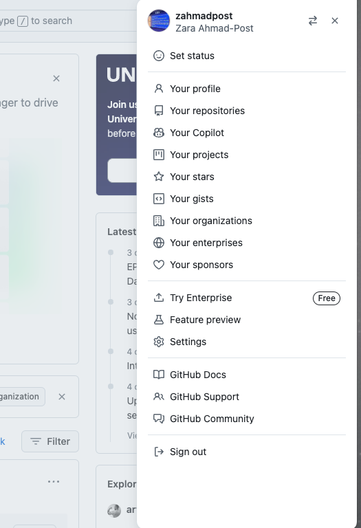
    
2. In the repository view, select the green “New” button to create a new repository in your personal GitHub profile. You can call it whatever you like, but something along the lines of <firstname_lastname_resume> will help you identify the repository in the future. 
3. You can make it public or private, it’s up to you. I recommend making it public so that employers can see a history of committed code in the repo. You don’t need to initialize it with a `README` or with a `.gitignore` file. 
4. Depending on how you started the assignment, follow these instructions: 
    
    **If did not clone the Assignment 6 Repository before proceeding with the assignment:** 
    
    On the next screen there are instructions to “…push an existing repository from the command line” You’ll want to use these instructions if you didn’t clone the assignment 6 repository. 
    
    From the root of your project directory (where you added your `.gitignore` file), run the commands listed on GitHub. They’ll look something like this:
    
    ```bash
    git remote add origin https://github.com/<userprofilename>/<remote_repository_name>.git
    git branch -M main
    git push -u origin main
    ```
    
    **If you already cloned the Assignment 6 Repository before proceeding with the assignment:** 
    
    You’ll need to update the remote url of your project. From the root of your project directory (where you added your `.gitignore` file) run the commands below to update the URL of your remote: 
    
    ```bash
    git remote set-url origin https://github.com/<userprofilename>/<remote_repository_name>.git
    ```
    
5. Run `git status` to see all of the files that will be committed to your repository. 
6. Then run `git add .`  and `git commit -m "Your commit message here"` . Then `git push` your changes to your repository. 

<aside>

If after you commit your code to your profile’s repository, you still see some assignment directories, you can remove them by running `git rm -r --cached` followed by a list of directories that you want to remove from the repo. For example:

```bash
git rm -r --cached part1 part2 docs img
```

</aside>

## **Step 2: Create a new App**

First, we need to create an app in App Platform:

1. Log in to your DigitalOcean account at `cloud.digitalocean.com` 
2. In the top middle right, select `Create` 
    
    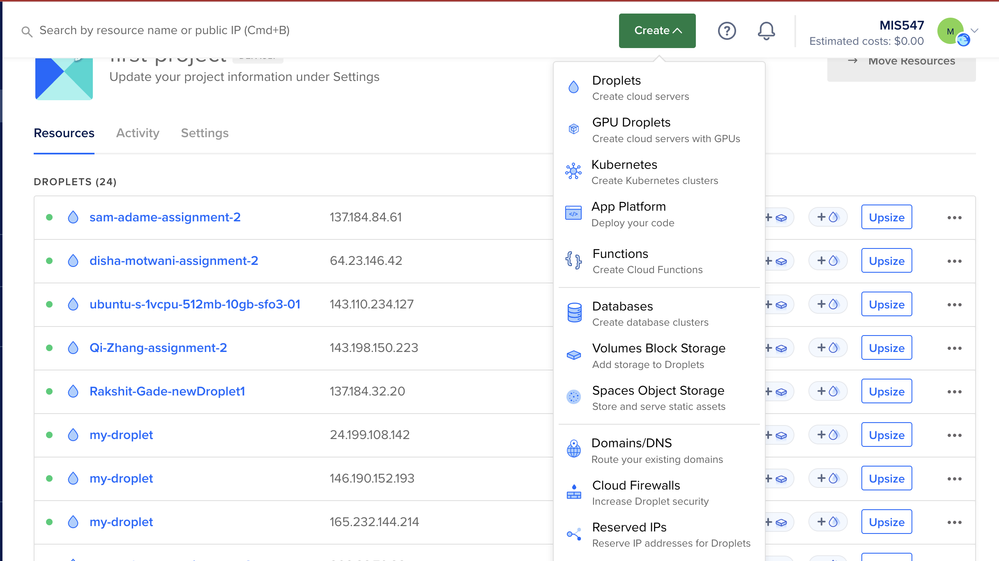
    
3. Select `App Platform` 
    
    In the App Configuration screen, you can choose the settings and sources for your app. Remember that we are now using Platform as a Service (PaaS), wherein the cloud platform handles all of the backend infrastructure for us. We aren’t provisioning VMs ourselves, we’re just telling the cloud where and how to run our code!
    
4. Our first option is to tell App Platform where our source code lives. Note that you have many options! If you want to deploy source code, you can choose GitHub or GitLab. If you wanted to deploy an application using a container image, you have the option of using Docker Hub, DigitalOcean Container Registry, or GitHub Container Registry. 
    
    We’ll choose GitHub. 
    

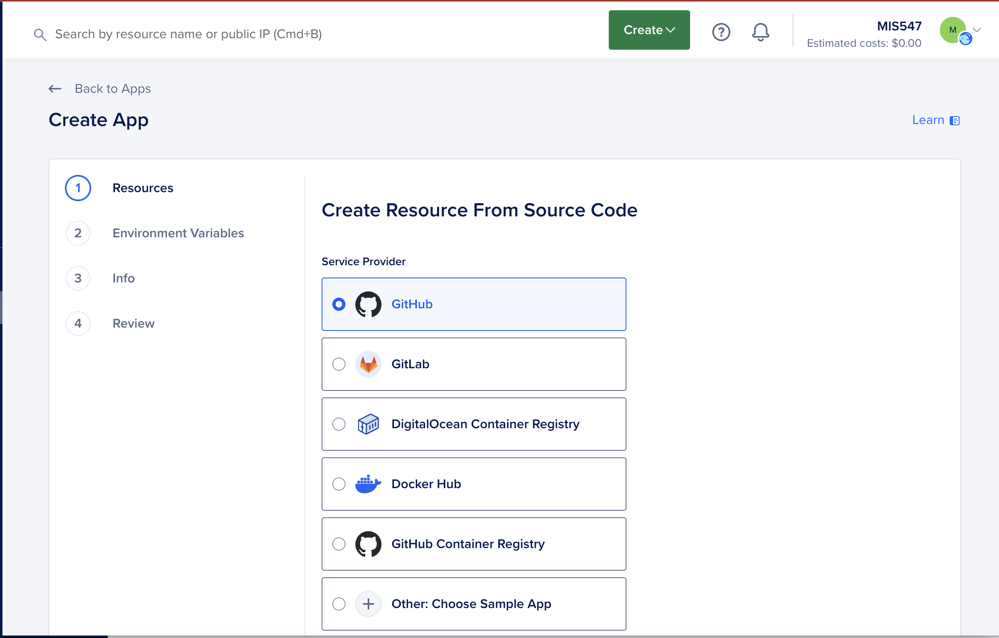

5. Next, we’ll give DigitalOcean App Platform access to our repository that contains our static site. 
    
    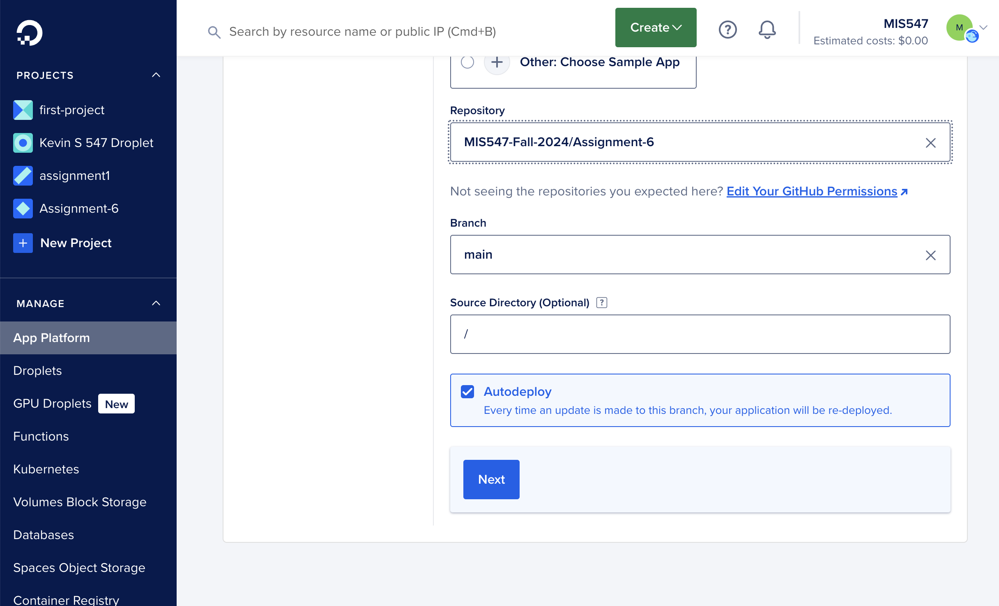
    
    <aside>
    
    **OLD INSTRUCTIONS:** 
    
    I have already allowed DigitalOcean App Platform to have access to any repository created in the `MIS547-Fall24` GitHub organization. There are a *lot* of them. A new repository is created in MIS547 org every time a student accepts an assignment. Scroll down to the repositories that start with “Assignment-6” and then find yours, and select it. 
    
    </aside>
    
    <aside>
    
    **NEW INSTRUCTIONS:**
    
    You need to grant App Platform access to the repository that hosts your code. Click on Manage Access and then choose your own profile. 
    
    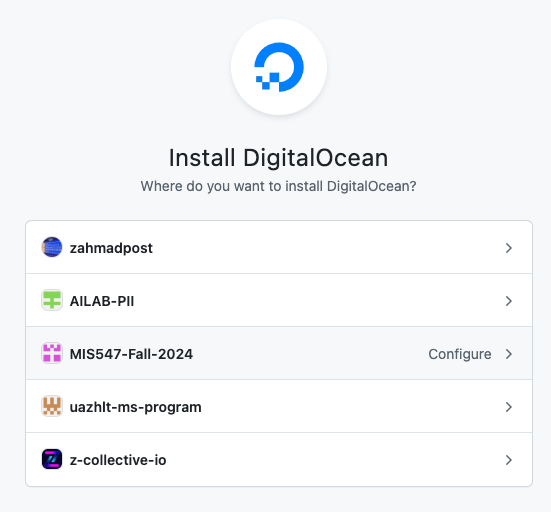
    
    You have the option to select all repositories or only the one that contains the code for your resume. 
    
    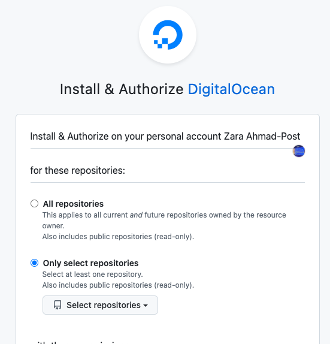
    
    If you don’t see your repository in the drop down, you can search for it in the search box. 
    
    When you’re done, select “Install and Authorize”. You should now be able to see the repository back in App Platform! 
    
    </aside>
    

6. Then ensure that **Autodeploy code changes** is checked, and press **next** to continue. 

7. You’ll be taken to a page where App Platform has detected your app’s configuration. You’ll see the resources detected from the configuration for your app.

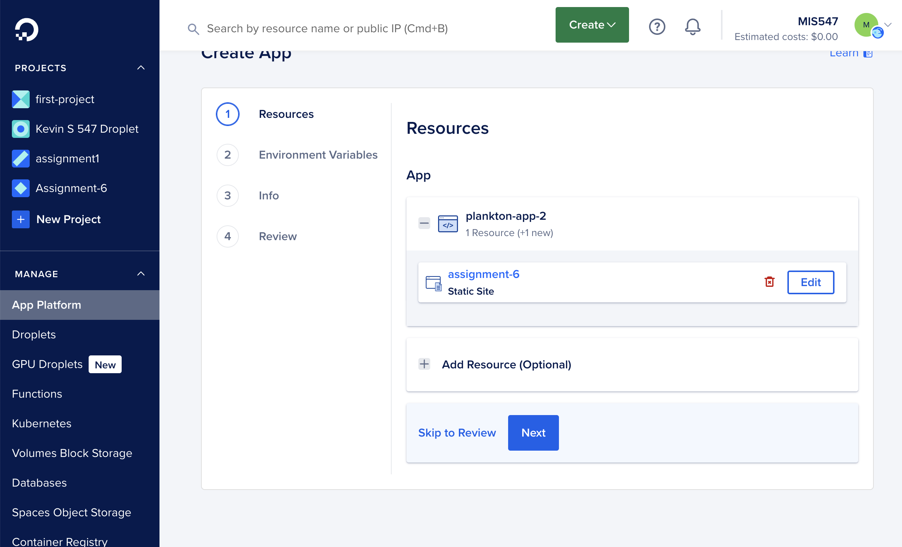

8. Click on “Edit” and then scroll down to see the Build Phase information. Under the “Build Command”, in the box, update the command as seen below. Click Save.

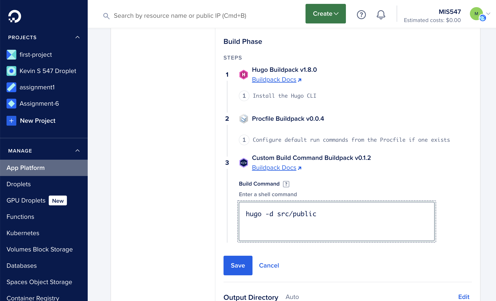

9. In the App Info section, next to the name of your app, select ‘Edit’. 

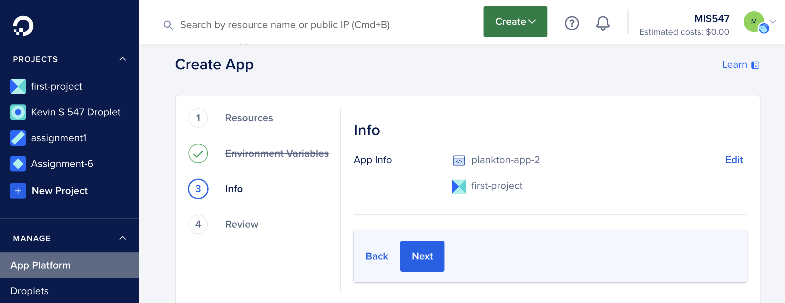

10. Change the project to Assignment 6 and click ‘Save’. 

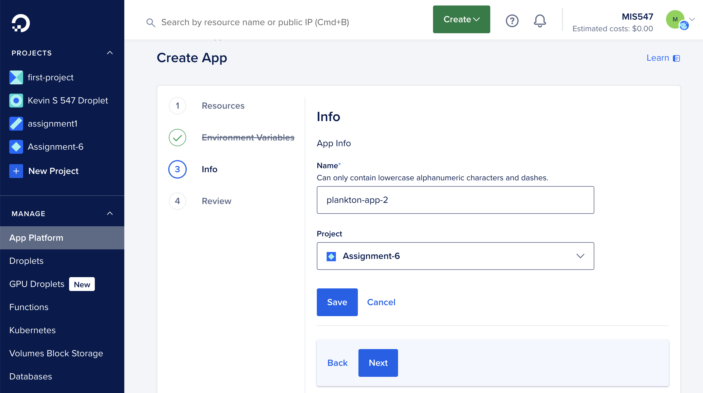

11. Under the ‘Review’ tab, review the configuration, then click Launch App. When your app is being deployed, you’ll have the opportunity to view the build logs by clicking on ‘Go to Build Logs’.

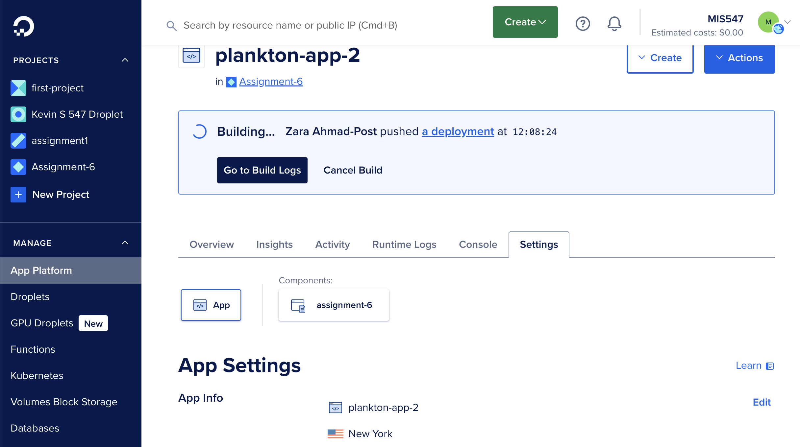

Once the build process completes, the interface will show you a healthy site and provide a link for you to visit the site. 

Now, whenever you make changes to your code and push the changes to your GitHub repository, the changes will be deployed on DigitalOcean! 

**In our next assignment, we’ll attach a custom domain to our App, as well as deploy some serverless code alongside it!**